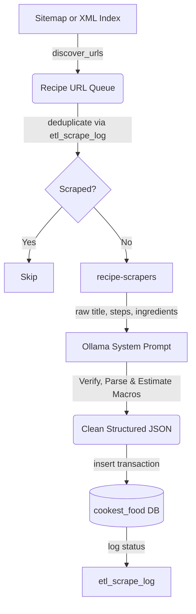

# Cookest Recipe Scraper & AI Normalizer Pipeline

This tool automates the process of building a massive recipe database by extracting schema data from traditional recipe websites and blogs, normalizing it using local AI (Ollama), and inserting it directly into the Cookest PostgreSQL database.

## Architecture & Flow



1. **URL Discovery**: Discovers recipes dynamically from standard XML sitemaps or sitemap indexes.
2. **Deduplication**: Checks the PostgreSQL `etl_scrape_log` table before scraping to prevent duplicate runs and respects server bandwidth.
3. **Extraction**: Invokes the `recipe-scrapers` microdata extraction engine to extract raw schema markup.
4. **AI Normalization & Translation (Ollama)**: Feeds raw data into a local LLM (e.g., `llama3.1:8b` or `qwen2.5:14b-instruct-q4_K_M`) to:
   - **Translate all text fields**: Automatically translates title, instructions, cuisine, category, ingredient names, units, and notes from any European language (German, French, Spanish, Italian, Portuguese, etc.) into clean English.
   - Clean and format ingredient names, quantities, and units.
   - Infer ingredient food categories (e.g., protein, dairy) and estimate weights in grams.
   - Restructure instructional steps to remove blog fluff/ads.
   - Estimate and verify nutritional macros (protein, carbs, fats, fiber, sodium, calories).
   - Set dietary restriction flags (`is_vegetarian`, `is_vegan`, `is_gluten_free`, `is_dairy_free`, `is_nut_free`).
5. **Database Transaction**: Upserts the recipe details, links the parsed ingredients, inserts sequential instructions, adds image references, inserts calculated nutritional macros, and logs the execution status under a single Postgres transaction.

---

## Installation & Setup

1. **Install Python virtualenv and dependencies**:
   ```bash
   cd cookest-backend/ai/scraper
   python3 -m venv venv
   
   # For Fish shell users:
   source venv/bin/activate.fish
   
   # For Bash/Zsh users:
   source venv/bin/activate
   
   pip install -r requirements.txt
   ```

2. **Ensure Ollama is running** and has your target model downloaded:
   ```bash
   ollama pull llama3.1:8b
   # Or a larger model (recommended for 32GB RAM servers):
   ollama pull qwen2.5:14b-instruct-q4_K_M
   ```

3. **Verify DB Connectivity**:
   Ensure PostgreSQL is running (e.g., via Docker Compose: `docker compose up -d food-db`). The pipeline reads configurations from the `cookest-backend/.env` file or environment variables.

---

## Usage Guide

### 1. Test run (Dry Run)
Before writing anything to the database, you can run a dry run to inspect the raw extraction and the Ollama normalized JSON on your terminal:
```bash
python scraper.py --url https://www.allrecipes.com/recipe/20144/banana-banana-bread/ --dry-run
```

### 2. Import a single recipe
To scrape, normalize, and insert a single recipe directly into the Postgres database:
```bash
python scraper.py --url https://www.allrecipes.com/recipe/20144/banana-banana-bread/
```

### 3. Crawl a sitemap / website
To crawl a recipe blog sitemap and import recipes in bulk (e.g. limit to 10 recipes in this run):
```bash
python scraper.py --sitemap https://www.joyofbaking.com/sitemap.xml --pattern "recipes" --limit 10
```

### 4. Bulk Multi-Site Crawl (Multiple sitemaps)
To crawl multiple websites in one execution, create a JSON configuration file (e.g., `sites_config.json`):
```json
[
  {
    "sitemap": "https://www.directoalpaladar.com/sitemap_index.xml",
    "pattern": "/recetas/",
    "limit": 5
  },
  {
    "sitemap": "https://www.chefkoch.de/sitemap_index.xml",
    "pattern": "/rezepte/",
    "limit": 5
  }
]
```
Run the crawler by passing this configuration:
```bash
python scraper.py --config sites_config.json
```

### Options Reference
| Argument | Description | Default / Example |
|---|---|---|
| `--url` | A single recipe URL to process. | `https://example.com/recipe` |
| `--sitemap` | XML sitemap or sitemap index URL to crawl. | `https://example.com/sitemap.xml` |
| `--pattern` | Regex pattern to filter matching URLs in the sitemap. | `--pattern "recipes"` |
| `--config` | Path to a JSON configuration file containing a list of sitemaps to crawl. | `--config sites_config.json` |
| `--limit` | Maximum number of new recipes to scrape in a sitemap crawl. | `10` |
| `--model` | Ollama model to invoke for normalization. | Reads `OLLAMA_MODEL` or falls back to `llama3.1:8b` |
| `--db-url` | PostgreSQL database connection string. | Reads `FOOD_DATABASE_URL` in `.env` |
| `--dry-run` | Run the pipeline but print output instead of writing to database. | Flags only |
| `--force` | Process URLs even if they exist in `etl_scrape_log` as successful. | Flags only |
| `--delay` | Delay in seconds between HTTP scraping requests (politeness). | `2.0` |
